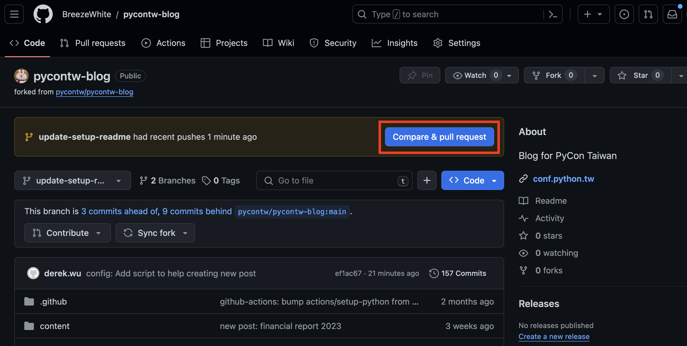
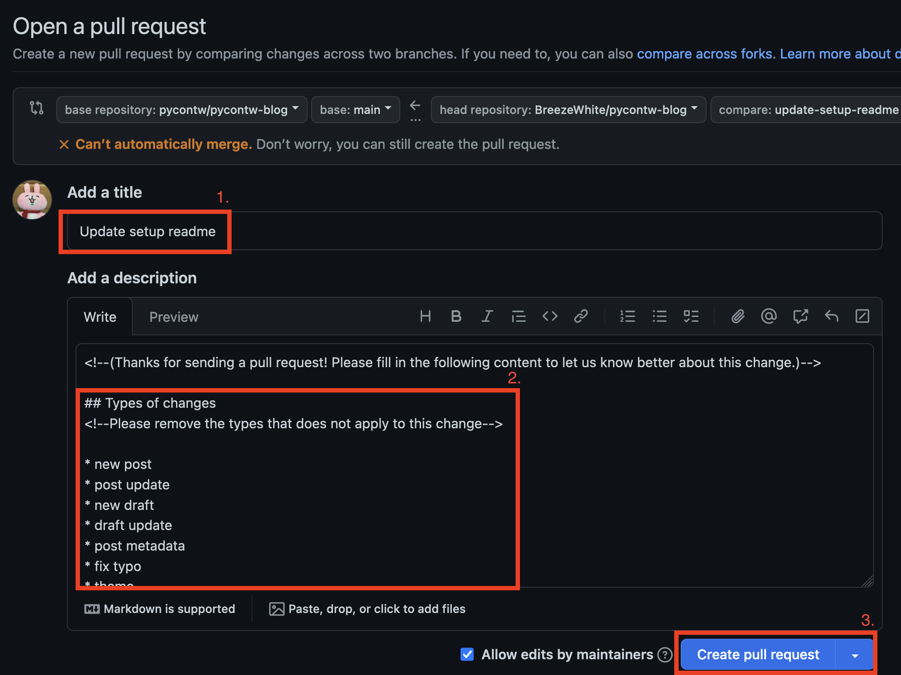

[](http://makeapullrequest.com)
[](https://github.com/astral-sh/ruff)

# PyCon Taiwan Blog

## Getting Started
### Environment Setup

1. Fork & Clone [pycontw-blog]

    For those who already know how to fork the repository, you can skip to the next step.

    <details>
    <summary>Click me</summary>

    1. Navigate to [pycontw-blog] and press the `Fork` button
    on the top right corner.
    

    2. Press `Create fork`
    

    3. Copy the URL of the forked repo
    
    </details>

2. Clone the forked repo

    ```bash
    git clone --recursive <YOUR_URL_HERE>
    ```

3. [Install uv]

    Use [uv] to setup the required version of Python.

    1. For MacOS / Linux users

    ```bash
    curl -LsSf https://astral.sh/uv/install.sh | sh
    ```

    2. For Windows users

    ```bash
    powershell -ExecutionPolicy ByPass -c "irm https://astral.sh/uv/install.ps1 | iex"
    ```

4. Setup Python and install dependencies

    ```bash
    uv sync
    ```

7. Setup [pre-commit](https://pre-commit.com/) hooks

    This will check common errors when you do certain types of git commits.

    ```bash
    uv run inv setup-pre-commit-hooks
    ```

### Write a new article

#### Quick Start

1. Create Post

    Run the following command to create a new post. Follow the steps to fill in all necessary information.

    ```bash
    uv run inv create-post
    ```

    Then open the newly created file under `content/posts` to finish editing the rest of the content body.
    The post is written in Markdown format. You can learn more about Markdown [here](https://www.markdownguide.org/cheat-sheet/).

2. Test Locally

    It's very ***IMPORTANT*** to test and run locally before committing anything. Run the following command to host the website locally.

    ```bash
    uv run inv livereload
    ```

    After executing the above command, open your browser and navigate to `http://localhost:8000/`.
    You should be able to see the new post you've just created.

3. Commit

    After all is ready, it's time to commit the modifications to the branch and push to the repository.

    ```bash
    git add <your_file>

    # Use commitizen to do git commit.
    # Choose the "new post" type if you're adding a new article
    uv run cz commit

    # Push to the remote branch.
    git push origin $(git rev-parse --abbrev-ref HEAD)
    ```

4. Create a Pull Request

    After pushing to the remote repository, go back to your GitHub page of your forked repository. There should be a very obvious pop up on top of the page like below.

    

    Press that `Compare & pull request` hardly and go to the next page.

    

    Modify the content of the red rectangle 1 and 2. After editing, press the `Create pull request` button. That's it!!

Congratulations!! You've done all the jobs to post a new blog article. The next is taking a rest, drinking a cup of tea, and waiting for the maintainer to come for reviewing your PR ~

#### More about the post

The post could be written in [Markdown] or [reStructuredText] format. The file should put under [content/posts](https://github.com/pycontw/pycontw-blog/tree/main/content/posts) folder. Your filename should be the English title of your article. You'll have to translate it if there's no English title.

The following is a minimal example of an article.
* In markdown
    ```markdown
    Title: My super post
    Date: 2010-12-03 10:20
    Modified: 2010-12-05 19:30
    Category: Python
    Tags: pelican, publishing
    Slug: my-super-post
    Authors: Alexis Metaireau, Conan Doyle
    Summary: Short version for index and feeds

    This is the content of my super blog post.
    ```
* In reStructuredText
    ```reStructuredText
    My super post
    ##############

    :date: 2010-10-03 10:20
    :modified: 2010-10-04 18:40
    :tags: that's, awesome
    :category: yeah
    :slug: my-super-post
    :authors: Alexis Metaireau, Conan Doyle
    :summary: Short version for index and feeds
    ```

    Please read [Writing content](https://docs.getpelican.com/en/latest/content.html) section in pelican documentation for format detail.


If you need to upload images, you'll need to create a directory for your posts in [content/images/readme/](https://github.com/pycontw/pycontw-blog/tree/main/content/images).


### How do we organize our data in the `content` directory?
TBD

## Authors
Wei Lee <weilee.rx@gmail.com>
Yoyo <miyashita2010@tuta.io>

[pycontw-blog]: https://github.com/pycontw/pycontw-blog
[Install uv]: https://docs.astral.sh/uv/getting-started/installation/
[uv]: https://docs.astral.sh/uv/
[Markdown]: https://markdown.tw/
[reStructuredText]: https://www.sphinx-doc.org/en/master/usage/restructuredtext/index.html
